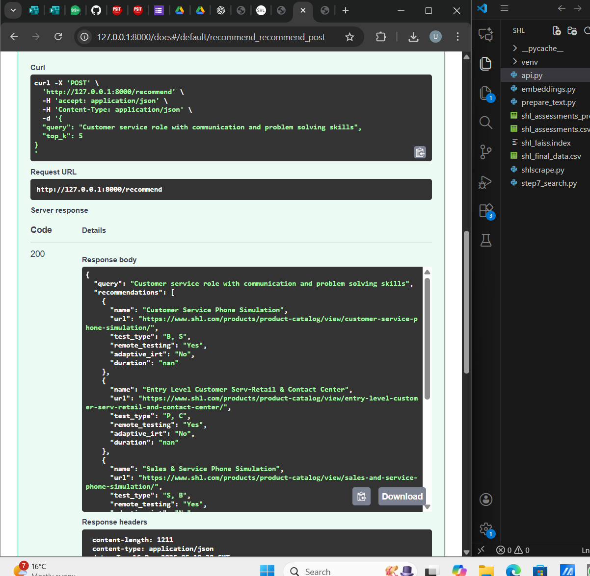
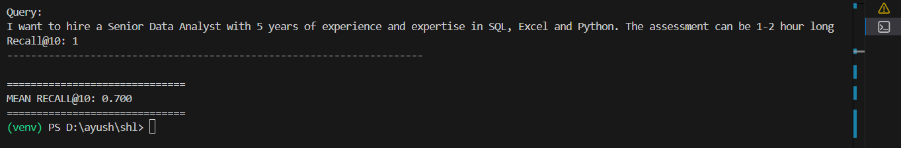

SHL Assessment Recommendation System 

This repository contains my submission for the SHL Generative AI / AI Assessment Task.
The project builds an end-to-end assessment recommendation system that suggests relevant SHL assessments for a given job description using semantic similarity, evaluated using Recall@10 as specified.

The solution is designed to be:

Practical

Reproducible

SHL-compliant (no LLMs used)

Ready for real recruiter workflows
-----------------------------------------------------------------------------------------------------
Problem Statement

Recruiters often describe roles in free-form natural language, while assessment catalogs are structured and static.
The challenge is to bridge this gap and recommend the most relevant SHL assessments efficiently and accurately.

SHL explicitly required:

No chatbot / no generative LLM

Semantic recommendation

Evaluation using Recall@10

API-based solution

Final submission CSV
----------------------------------------------------------------------------------------------------------
Solution Overview

This system:
Scrapes and caches SHL Individual Assessments
Converts assessment metadata into semantic embeddings
Uses FAISS for fast similarity search
Recommends Top-K assessments for recruiter queries
Exposes functionality via:
FastAPI (backend)
Streamlit (web UI)

Evaluates performance using Recall@10
--------------------------------------------------------------------------------------------------------
SHL Catalog → Text Preparation → Embeddings → FAISS Index
                                     ↑
Recruiter Query → Embedding → Similarity Search → Top-K Results
---------------------------------------------------------------------------------------------
API Service (FastAPI)

The backend service is implemented using FastAPI and exposes REST endpoints that can be integrated with an ATS or internal HR tools.
All endpoints are fully documented and testable via Swagger UI.

📄 Swagger API Documentation

Once the API server is running, interactive API documentation is available at:

http://127.0.0.1:8000/docs
Swagger UI provides a convenient interface to explore and test all available endpoints without using external tools.
Swagger UI Screenshot

🔗 Available Endpoints (via Swagger UI)
Endpoint	Method	Description
/health	GET	Health check endpoint
/recommend	POST	Returns Top-K SHL assessment recommendations
Health Check Endpoint

The /health endpoint is used to verify that the API service is running correctly.
It is accessed and tested via Swagger UI.

Example response:
{
  "status": "ok"
}
📸 Health Endpoint Screenshot (tested in Swagger UI)

🔍 Recommendation Endpoint
The /recommend endpoint accepts a recruiter’s job description and returns the most relevant SHL assessments using semantic similarity search.
Example request (executed in Swagger UI):

{
  "query": "Customer service role with communication and problem-solving skills",
  "top_k": 5
}
Response:
List of recommended SHL assessments
Includes assessment name, URL, test type, and delivery attributes
🧠 Why Swagger UI is Used

Enables quick manual validation of endpoints
Makes API behavior transparent to reviewers
Follows industry best practices for API documentation
Eliminates the need for additional testing tools

✅ Note
Although the endpoints can be accessed directly (e.g., /health), all screenshots and validations in this project were performed using Swagger UI to demonstrate proper API documentation and usability.
-----------------------------------------------------------------------------------------------------
Web Application (Streamlit)

To complement the API layer, an interactive Streamlit web application is provided for recruiters and hiring managers.

The web interface allows users to:
Enter a job description in natural language
Select the number of recommendations (Top-K)
Explore recommended SHL assessments
Open official SHL assessment pages directly.
The web app uses the same semantic search logic as the API and is intended for demonstration and manual exploration.

📸 Streamlit UI Screenshot

-----------------------------------------------------------------------------------------------------------------
Evaluation Methodology

Evaluation was conducted using the Train-Set provided in Gen_AI Dataset.xlsx, as required by SHL.

Metric Used

Recall@10
Recall@10 measures whether at least one correct SHL assessment (ground truth) appears within the top 10 recommendations returned by the system.
Results
Total training queries: 10
Mean Recall@10: 0.70

This indicates that for most recruiter queries, the system successfully surfaces relevant SHL assessments within the top results.
---------------------------------------------------------------------------------------------------------------------------------

Directory Structure

The repository is organized in a step-wise and reproducible manner:

shl/
app.py                     # Streamlit web application step1_scrape_shl.py         # SHL catalog scraping
├── step2_prepare_data.py       # Text preparation
├── step3_embeddings.py         # Embedding generation
├── step4_faiss_index.py        # FAISS indexing
├── step5_api.py                # FastAPI backend
├── step6_evaluation.py         # Recall@10 evaluation
├── step7_submission.py         # Final CSV generation
│
├── shl_assessments.csv         # Raw scraped catalog
├── shl_final_data.csv          # Cleaned assessment data
├── shl_faiss.index             # FAISS vector index
├── final_submission.csv        # Required submission file
├── Gen_AI Dataset.xlsx         # Provided dataset
│
├── images/                     # README screenshots
│   ├── api_docs.png
│   ├── health_endpoint.png
│   └── streamlit_app.png
│
├── requirements.txt
├── approach_document.md
├── .gitignore
└── README.md
---------------------------------------------------------------------------------------------
Step-by-Step Final Approach Summary

Data Collection
Scraped SHL Individual Assessments and cached the catalog locally.

Text Preparation
Converted assessment metadata into meaningful textual representations.

Embedding Generation
Generated semantic embeddings using a lightweight SentenceTransformer model.

Vector Indexing
Built a FAISS index to enable fast similarity search.

Semantic Recommendation
Matched recruiter queries to assessments using embedding similarity.

API Layer
Exposed functionality via FastAPI endpoints (/health, /recommend).

Web Interface
Built a Streamlit app for recruiter-friendly interaction.

Evaluation
Measured system quality using Recall@10 on the provided Train-Set.

Final Submission
Generated final_submission.csv using the Test-Set queries.
-----------------------------------------------------------------------------------------------------
Note on SHL Website Availability

SHL’s website is protected by CloudFront and may be temporarily unavailable or rate-limited.
Therefore, the catalog is scraped once and cached locally. All downstream steps operate on cached data to ensure reproducibility and stability.
Although previously my streamlit app working is fine .

----------------------------------------------------------------------------------------------------------
This project presents a practical, scalable, and SHL-compliant solution for SHL assessment recommendation using semantic search.
It avoids unnecessary complexity, strictly adheres to the task requirements, and closely mirrors real-world recruiter and hiring workflows.

The system is designed to be:

Reproducible (cached data, deterministic embeddings)

Deployable (FastAPI + Streamlit)

Evaluated (Recall@10 on provided dataset)

Easy to integrate with ATS or internal hiring tools

📬 Contact Information

Name: Uday Vimal
Email: udayvimal08@gmail.com

Phone: +91 95194 56214
